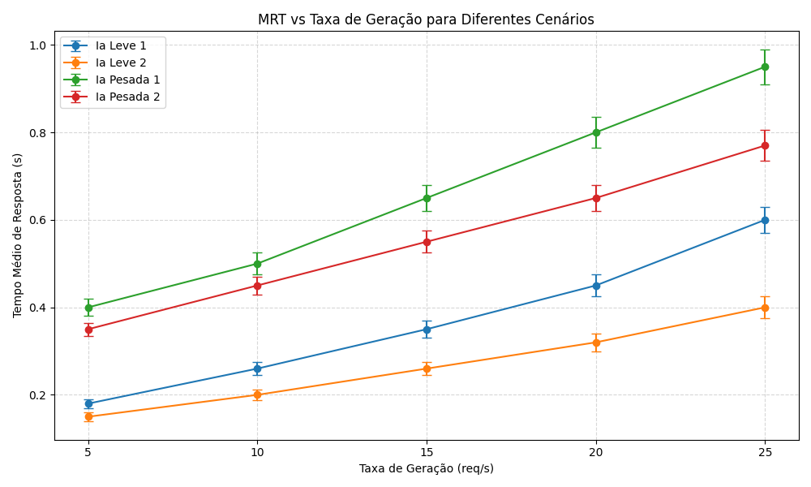

# SD---TrabalhoFinal

# PASID Validator - Experimentos com IA Distribuída

Este projeto tem como objetivo avaliar o desempenho de diferentes configurações de serviços de inteligência artificial (IA) em um sistema distribuído baseado em containers Docker. Utilizando a ferramenta PASID-VALIDATOR, foi implementada uma infraestrutura que simula um ambiente com múltiplos nós, balanceadores de carga e serviços de IA, para medir o Tempo Médio de Resposta (MRT) em diferentes cenários.

## 📡 Arquitetura do Sistema

A arquitetura é composta por três nós principais:

- **Nó 01 - Source:** responsável por gerar as requisições.
- **Nó 02 - LoadBalancer1:** distribui as requisições entre instâncias de modelos leves.
- **Nó 03 - LoadBalancer2:** distribui as requisições entre instâncias de modelos pesados.

Cada requisição enviada pelo Source é monitorada em tempo real, e os dados de tempo de resposta são coletados para análise de desempenho.

## ⚙️ Cenários Avaliados

Foram testadas quatro configurações distintas:

- **IA Leve 1:** modelo leve executado em uma única instância.
- **IA Leve 2:** modelo leve executado em duas instâncias com balanceamento de carga.
- **IA Pesada 1:** modelo pesado executado em uma única instância.
- **IA Pesada 2:** modelo pesado executado em duas instâncias com balanceamento de carga.

## 📈 Gráfico de Desempenho

Durante os testes, variou-se a taxa de geração de requisições (de 5 até 25 requisições por segundo) e foram coletados os tempos médios de resposta (MRT) em cada configuração.

Abaixo está o gráfico gerado com os resultados obtidos:

Os resultados mostram que o uso de réplicas melhora significativamente o desempenho, principalmente quando utilizado com modelos leves. Já os modelos pesados apresentaram tempos médios mais altos, mas também se beneficiaram do balanceamento de carga. O projeto evidencia, na prática, como decisões arquiteturais impactam diretamente na escalabilidade e na eficiência de sistemas distribuídos com serviços de IA.
